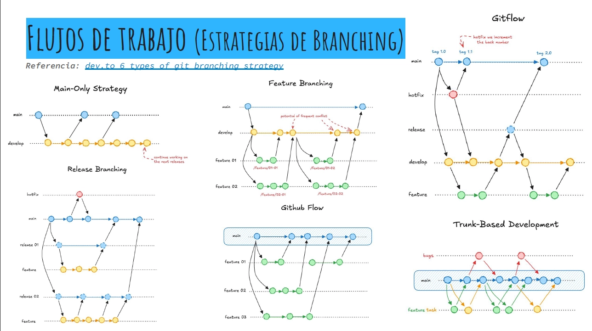

# Guia de contribucion

Este documento define como trabajar en el repositorio MAPS Asesores: ramas, commits, Pull Requests, verificaciones y definition of done.

Para convenciones especificas de documentacion tecnica, TDDs y work-logs, ver [`CONVENTIONS.md`](./CONVENTIONS.md).

---

## Estrategia de ramas



Ramas principales:

| Rama | Uso |
|------|-----|
| `main` | Rama estable/release. No se trabaja directo sobre esta rama. |
| `development` | Rama de integracion continua del equipo. Los PRs de feature/fix entran aca. |

Ramas de trabajo:

| Tipo | Formato | Uso |
|------|---------|-----|
| Feature | `feature/MAPS-XXX-slug-corto` | Nueva funcionalidad o cambio funcional no trivial |
| Fix | `fix/MAPS-XXX-slug-corto` | Correccion de bug |
| Docs | `docs/MAPS-XXX-slug-corto` | Cambios solo de documentacion |
| Refactor | `refactor/MAPS-XXX-slug-corto` | Reorganizacion sin cambio de comportamiento |
| Chore | `chore/MAPS-XXX-slug-corto` | Mantenimiento, tooling o configuracion |

Si el ticket aun no tiene numero definitivo, usar `MAPS-XXX` y reemplazarlo antes de cerrar el PR si corresponde.

---

## Flujo de trabajo

1. Actualizar la rama base:

   ```bash
   git checkout development
   git pull origin development
   ```

2. Crear rama de trabajo:

   ```bash
   git checkout -b feature/MAPS-XXX-mi-feature
   ```

3. Implementar cambios en commits atomicos.
4. Ejecutar verificaciones locales relevantes.
5. Actualizar documentacion si el cambio modifica comportamiento, setup, arquitectura o estado de un modulo.
6. Abrir Pull Request hacia `development`.
7. Atender feedback de review.
8. Mergear solo cuando CI y review esten aprobados.

---

## Convencion de commits

Formato obligatorio:

```bash
tipo(scope): descripcion
```

Ejemplos:

```bash
feat(producers): add certification upload
fix(auth): handle expired refresh token
docs(docker): document development compose flow
build(docker): add frontend dev target
ci(github): add backend test job
```

### Tipos validos

| Tipo | Uso |
|------|-----|
| `feat` | Nueva funcionalidad |
| `fix` | Correccion de bug |
| `docs` | Documentacion |
| `style` | Formato/cambios esteticos sin impacto funcional |
| `refactor` | Refactor sin cambio observable |
| `test` | Tests |
| `chore` | Mantenimiento general |
| `build` | Build system, Docker, dependencias |
| `ci` | GitHub Actions u otra automatizacion CI |
| `perf` | Mejoras de performance |
| `revert` | Revert de un cambio previo |

### Scopes sugeridos

- `frontend`
- `backend`
- `auth`
- `producers`
- `profile`
- `library`
- `news`
- `admin`
- `docker`
- `db`
- `ci`
- `docs`
- `testing`

Reglas:

- Usar descripcion breve en infinitivo o presente simple, sin punto final.
- Preferir commits chicos y atomicos.
- No mezclar refactors grandes con cambios funcionales.
- No commitear `.env`, builds generados, `node_modules`, dumps de DB ni archivos del editor.

---

## Pull Requests

Todo cambio debe entrar por Pull Request hacia `development`, salvo hotfixes excepcionales acordados por el equipo.

Un PR debe incluir:

- Descripcion clara del problema y la solucion.
- Lista de cambios principales.
- Como se verifico.
- Riesgos, trade-offs o decisiones relevantes.
- Capturas o evidencia visual si toca UI.
- Links a TDD/work-log si aplica.

Titulo recomendado del PR:

```bash
tipo(scope): descripcion
```

Ejemplo:

```bash
build(docker): add fullstack development compose
```

---

## Verificaciones antes de pedir review

Ejecutar lo que aplique segun los archivos tocados.

Backend:

```bash
cd backend
npm run typecheck
npm run lint
npm run build
npm test
```

Frontend:

```bash
cd frontend
npm run typecheck
npm run lint
npm run build
```

Docker:

```bash
docker compose up -d --build
docker compose ps
```

Base de datos:

```bash
docker compose exec backend npx prisma migrate deploy
docker compose exec backend npm run db:seed
```

Si no se pudo ejecutar alguna verificacion, aclararlo en la descripcion del PR.

---

## Definition of done

Un cambio se considera terminado cuando:

- [ ] El PR apunta a `development`.
- [ ] El titulo del PR sigue `tipo(scope): descripcion`.
- [ ] Los commits son atomicos y descriptivos.
- [ ] El codigo compila y pasa las verificaciones relevantes.
- [ ] No se agregaron archivos innecesarios o sensibles.
- [ ] La documentacion viva fue actualizada si cambio el comportamiento actual.
- [ ] Existe TDD si el cambio lo requiere segun [`CONVENTIONS.md`](./CONVENTIONS.md).
- [ ] Existe work-log si el PR cierra una feature no trivial.
- [ ] Se documentaron trade-offs o riesgos relevantes.
- [ ] El PR fue revisado y aprobado.

---

## Relacion con TDDs y work-logs

- Para cambios grandes o con decisiones relevantes, crear TDD antes de implementar.
- Para features no triviales ya implementadas, cerrar con work-log.
- Si una feature cambia el estado actual del sistema, actualizar tambien README, `docs/modules/*`, `ARCHITECTURE.md`, `TESTING.md` o `MIGRATIONS.md` segun corresponda.
- Los TDDs y work-logs no reemplazan a la documentacion viva.
