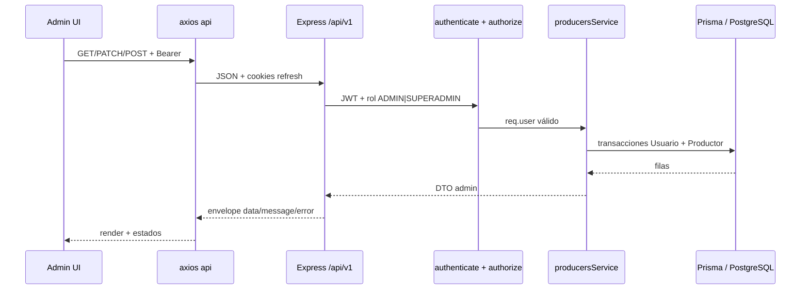

# MAPS-009 — TDD: Admin API Productores (integración backend)

Documento de diseño técnico para conectar el módulo administrativo de productores con la API y la base de datos real dentro del proyecto MAPS Asesores, reemplazando progresivamente el comportamiento mock (Zustand + datos en memoria) introducido en MAPS-007.

**Estado:** Implementado  
**Autor:** (equipo)  
**Revisores:** —  
**Creado:** 2026-05-14  
**Última actualización:** 2026-05-14  

> **Bitácora de cierre:** [`docs/worklog/MAPS-009-admin-api-productores.md`](../worklog/MAPS-009-admin-api-productores.md).  
> Las secciones **2–18** conservan el relato de **diseño y contexto histórico** (estado previo a la codificación); el **resultado efectivo**, decisiones finales de producto/backend/frontend y verificación están centralizadas en la **§ 19**.

---

## 1. Resumen

El panel admin de productores (`/admin/productores`, `/admin/inactivos`) quedó integrado con la API REST bajo `/api/v1/producers`, persistencia Prisma y auth JWT para roles **ADMIN** y **SUPERADMIN**. El mock Zustand (`useProducers`) y `producersMock.ts` fueron retirados del flujo principal. Perfil público, mapa, intranet productor y noticias siguieron fuera de alcance — ver § 19 y el work-log.

---

## 2. Objetivo

- Exponer endpoints auditables y seguros bajo `/api/v1/producers` (o subruta acordada) para que **ADMIN** y **SUPERADMIN** gestionen productores contra PostgreSQL vía Prisma.
- Permitir en el front reemplazar el store mock por llamadas reales manteniendo la UX actual (tablas, filtros, modales, paginación).
- Dejar documentado el contrato (request/response, errores, permisos) y un plan por fases mergeable.
- Al cerrar la última PR de implementación, el **work-log** `docs/worklog/MAPS-009-*.md` registrará el resultado; este TDD pasará a estado **Implementado** con enlaces a PRs y work-log.

---

## 3. Contexto actual

> **Histórico (redacción del TDD):** las tablas 3.1 y 3.2 describen lo relevado antes de implementar código. Para el **después de MAPS-009** ver [**§19**](#19-cierre-maps-009--decisiones-y-alcance-efectivo) y [`docs/worklog/MAPS-009-admin-api-productores.md`](../worklog/MAPS-009-admin-api-productores.md).

### 3.1 Backend

| Área | Estado |
|------|--------|
| **Rutas** | `backend/src/api/v1/index.ts` registra `v1Router.use('/producers', producersRouter)`. `backend/src/api/v1/routes/producers.routes.ts` exporta un `Router()` **sin rutas registradas**. |
| **Controller** | `backend/src/controllers/producers.controller.ts` solo expone `placeholder` → `501` con envelope `{ data, message, error }`. |
| **Service** | `backend/src/services/producers.service.ts` es `export const producersService = {}`. |
| **Prisma** | `backend/prisma/schema.prisma`: `Usuario` (rol, `activo`, credenciales), `Productor` (1:1 con `usuarioId`, `slug`, `nombre`, `apellido`, `bio`, `ciudad`, `dni`, `foto`, geo opcional, `telefono`). **No** hay `sucursal`, ni flag `estado` en `Productor`. |
| **Validaciones** | `backend/src/validations/producer.schema.ts` define `id` como **UUID** (`z.string().uuid()`), inconsistente con `Int` en Prisma. |
| **Auth** | `authenticate` en `backend/src/middlewares/authenticate.ts` verifica JWT y asigna `req.user` (`JWTPayload`: `sub`, `role`). Login real en `authController` + `authService` con envelope estándar. |
| **Authorize / validate** | `backend/src/middlewares/authorize.ts` y `validate.ts` son **no-op** (siguen al `next()` sin comprobar roles ni Zod). |
| **Seed** | `backend/prisma/seed.ts` solo crea usuarios `admin` y `superadmin`; **no** hay productores de ejemplo en BD. |

### 3.2 Frontend admin

| Pieza | Ubicación | Nota |
|-------|-----------|------|
| Páginas | `frontend/src/modules/admin/pages/ProducersPage.tsx` (`scope="all"`), `InactiveProducersPage.tsx` (`scope="inactive"`) | |
| Orquestador | `frontend/src/modules/admin/components/ProducersDashboard.tsx` | Lee/escribe `useProducers`; modales de filtro, form, vista, confirmar activar/desactivar. |
| Store mock | `frontend/src/modules/admin/hooks/useProducers.ts` | Zustand; `id` string generado; `removeProducer` existe pero **no se usa** en el dashboard (baja lógica = cambio de estado). |
| Tipos UI | `frontend/src/modules/admin/types/producer.ts` | `Producer` con `nombre` único (display), `email`, `sucursal`, `estado`, `ultimaActividad`, `fechaAlta`, `id: string`. |
| Filtros | `frontend/src/modules/admin/hooks/useProducerFilters.ts` | Filtra por estado, sucursal, fechas, búsqueda texto (nombre/dni/email). |
| Formulario | `frontend/src/modules/admin/components/ProducerFormModal.tsx` | Validación local: DNI 7–9 dígitos, email, teléfono obligatorio. |
| HTTP cliente | `frontend/src/lib/axios.ts` | `api` con `VITE_API_BASE_URL`, cookies, refresh en 401; ya usado en login. |

### 3.3 Enrutamiento y guards (permisos UI)

- `frontend/src/router/index.tsx`: rama `admin` bajo `ProtectedRoutes`; hijos con `RoleGuard allowedRoles={['ADMIN','SUPERADMIN']}` para dashboard, productores, inactivos, noticias, etc. `PRODUCTOR` usa otra rama `intranet` con guard propio.
- `frontend/src/router/RoleGuard.tsx`: si el rol no está permitido → `/unauthorized`.

### 3.4 Por qué ahora

MAPS-007 dejó la UI admin de productores presentable con mocks; MAPS-008 (contexto de producto) estabilizó navegación y otras áreas. El siguiente paso natural es persistencia y seguridad en servidor para demos y operación real, reutilizando auth ya implementada.

---

## 4. Alcance

- Definir e implementar **contrato REST** para administración de productores (listar, detalle admin, crear, actualizar datos, activar/desactivar cuenta).
- Completar **capa backend**: rutas Express, middlewares `authenticate` + **`authorize` real** + **`validate` real** (o patrón equivalente), servicio Prisma, manejo de errores alineado a `AppError` / `errorHandler`.
- Alinear **modelo de datos** entre UI y Prisma (campos faltantes o mapeos documentados; migraciones si se agregan columnas).
- **Frontend**: capa de servicios API, hooks de datos, estados loading/error/empty, sustitución del flujo mock en `ProducersDashboard` (y dependencias) respetando componentes existentes donde sea posible.
- **RBAC**: solo `ADMIN` y `SUPERADMIN` en estos endpoints; `PRODUCTOR` sin acceso.
- Documentar **activos/inactivos** con reglas de negocio explícitas.
- **Fuera de esta feature** (sección 5): noticias, biblioteca, mapa backend, perfil público por API, intranet productor, ecommerce.

---

## 5. Fuera de alcance

- Noticias (`/admin/noticias` mock y futuro backend noticias).
- Biblioteca digital — ver [MAPS-012-tdd-biblioteca-digital-api.md](./MAPS-012-tdd-biblioteca-digital-api.md) (ticket separado).
- **Mapa** alimentado desde backend / geo queries.
- **Perfil público** real (`/productor/:slug`) servido por API; cualquier UI mock puede mantenerse sin contrato estable en esta entrega.
- **Intranet productor** (edición de perfil por el propio productor, MR separate).
- Ecommerce / cotizador.
- Rediseño visual grande del admin.
- Deploy / infra cloud.
- **Eliminación física** de usuarios/productores (salvo que negocio lo pida en otra historia); el mock expone `removeProducer` pero el flujo admin actual es activar/desactivar.

---

## 6. Diseño propuesto

### 6.1 Resumen arquitectónico



- **Estado ACTIVO/INACTIVO en admin**: mapear a `Usuario.activo` (`true` → ACTIVO, `false` → INACTIVO). Coherente con `authService.login` que ya rechaza `!user.activo` con `403`. No duplicar flag en `Productor` salvo requerimiento futuro de “perfil oculto pero usuario activo”.

- **Identificadores**: API y UI deberían usar **`productor.id` (Int)** como clave principal en admin; el `slug` queda para rutas públicas (fuera de alcance de contrato estable aquí).

- **Nombre en UI**: el formulario tiene un solo campo `nombre`. **Propuesta**: en create/update, partir `nombre` en primera palabra → `Productor.nombre` y resto → `Productor.apellido` (o regla explícita “todo en nombre, apellido vacío” — ver preguntas abiertas).

- **Email en UI vs `Usuario.usuario`**: alinear; opción por defecto: **`usuario` = email** en alta de productor para simplificar login.

- **Sucursal y última actividad**: no existen en schema; ver sección 8 y decisiones (columna nueva vs derive de `ciudad` vs eliminar de dominio).

### 6.2 Capa frontend recomendada

| Ubicación sugerida | Rol |
|--------------------|-----|
| `frontend/src/modules/admin/services/producersApi.ts` (o `shared/services` si se prefiere reuso futuro) | Funciones puras: `listProducers`, `getProducer`, `createProducer`, `updateProducer`, `setProducerActivo` — usan `api` de `frontend/src/lib/axios.ts`. |
| `frontend/src/modules/admin/hooks/useAdminProducers.ts` (nombre ajustable) | Orquesta query/mutation, expone `data`, `isLoading`, `error`, `refetch`, handlers para modales. |
| Estado servidor vs cliente | **Recomendación**: introducir **TanStack Query** (`@tanstack/react-query`) para caching, invalidación tras mutaciones y estados estándar; el proyecto aún no lo usa (login es imperativo con Zustand). Alternativa mínima: hooks con `useState/useEffect` + `api` (más código repetido). |
| Zustand `useProducers` | **Deprecar** para datos reales: o bien eliminar tras migración, o reducir a UI-only (preferir eliminar para evitar doble fuente de verdad). |

### 6.3 Componentes / archivos afectados (previstos)

| Pieza | Ubicación | Rol |
|-------|-----------|-----|
| Rutas producers | `backend/src/api/v1/routes/producers.routes.ts` | Modificado — registrar rutas + middlewares. |
| Controller / service | `backend/src/controllers/producers.controller.ts`, `backend/src/services/producers.service.ts` | Modificado — implementación real. |
| Schemas Zod | `backend/src/validations/producer.schema.ts` (+ nuevos fragments) | Modificado — ids numéricos, bodies de create/update, query list. |
| authorize / validate | `backend/src/middlewares/authorize.ts`, `validate.ts` | Modificado — implementación real (esta feature o prerequisito explícito en Fase 0). |
| Migración Prisma | `backend/prisma/migrations/...` | Condicional — si se agregan columnas (sucursal, etc.). |
| Servicios + hooks front | `frontend/src/modules/admin/services/*`, `hooks/*` | Nuevo/Modificado. |
| Tipos TS front | `frontend/src/modules/admin/types/producer.ts` | Modificado — IDs numéricos, campos alineados a DTO; opción `AdminProducer` separado del futuro DTO público. |
| `ProducersDashboard.tsx` | `frontend/src/modules/admin/components/ProducersDashboard.tsx` | Modificado — cablear hooks API; mantener presentación. |

### 6.4 Decisiones tomadas (propuesta para review)

- Envelope HTTP homogéneo con auth: `{ data, message, error }`.
- IDs de productor como entero en JSON; path param `:id` numérico validado con Zod.
- Activar/desactivar = actualizar `Usuario.activo` en transacción con consistencia de sesiones (ver riesgos).
- Crear productor = crear `Usuario` (rol `PRODUCTOR`) + `Productor` en una transacción; exigir estrategia de password documentada (ver preguntas abiertas).
- Perfil público y mapa no bloquean esta entrega: endpoints pueden incluir `slug` en listado admin para uso futuro sin comprometer contrato público.

### 6.5 Alternativas consideradas

**A — Subrouter `/api/v1/admin/producers`**  
- **Pros:** separación semántica admin vs futuro API pública.  
- **Contras:** requiere nuevo mount y actualizar `axios` base paths o prefijos en cliente.  
- **Recomendación inicial:** mantener `/producers` con `authorize(ADMIN, SUPERADMIN)` para menos churn; revaluar al exponer lectura pública.

**B — Estado inactivo solo en tabla `Productor`**  
- **Pros:** desacopla “cuenta” de “visibilidad”.  
- **Contras:** duplica concepto con `Usuario.activo` y choca con login ya basado en `Usuario.activo`.  
- **Descartada** salvo nuevo requisito de negocio.

---

## 7. Endpoints requeridos

Convención: prefijo base `http://localhost:3000/api/v1` (prod: mismo path relativo). Todos requieren `Authorization: Bearer <accessToken>` salvo nota.

| Método | Ruta | Estado hoy | Acción |
|--------|------|------------|--------|
| `GET` | `/producers` | No existe (router vacío) | **Nuevo** — listado admin con filtros/paginación (ver query). |
| `GET` | `/producers/:id` | No existe | **Nuevo** — detalle admin (incl. datos de usuario necesarios). |
| `POST` | `/producers` | No existe | **Nuevo** — alta Usuario + Productor. |
| `PATCH` | `/producers/:id` | No existe | **Nuevo** — actualizar datos de perfil negocio (nombre, apellido, dni, tel, foto, bio, ciudad, slug si se permite editar, redes…). |
| `PATCH` | `/producers/:id/activo` (o `PATCH` body `{ activo: boolean }`) | No existe | **Nuevo** — activar/desactivar (mapea a UI “Reactivar/Desactivar”). |

**Query sugerido `GET /producers`:**

- `estado`: `activo` \| `inactivo` \| omitido (todos).
- `q` o `search`: texto libre (nombre, DNI, usuario/email).
- `page`, `pageSize` (o `limit`/`offset`): paginación **server-side** recomendada cuando la tabla crezca; la UI hoy pagina en cliente — Fase 1 puede mantener cliente si el volumen es bajo, con TODO explícito.
- Filtros tipo `sucursal` / rangos de fecha: solo si persisten en BD o se derivan (ver modelo).

**Respuesta lista (ejemplo conceptual):**

```json
{
  "data": {
    "items": [
      {
        "id": 1,
        "slug": "carlos-gomez",
        "nombre": "Carlos",
        "apellido": "Gomez",
        "nombreCompleto": "Carlos Gomez",
        "dni": "12345678",
        "usuario": "carlos.gomez@maps.com.ar",
        "telefono": "+54 11 4444-1010",
        "foto": "https://...",
        "activo": true,
        "estado": "ACTIVO",
        "ciudad": "Buenos Aires",
        "sucursal": null,
        "fechaAlta": "2025-01-10T12:00:00.000Z",
        "ultimaActividad": "2026-05-14T10:00:00.000Z"
      }
    ],
    "total": 42
  },
  "message": "OK",
  "error": null
}
```

Los campos `estado` y `ultimaActividad` pueden ser **derivados** en servidor para no romper la UI (ver sección 8).

**Errores:** reutilizar patrones de `auth` (`400` validación con `flatten()`, `401` sin token, `403` rol o cuenta desactivada, `404` no encontrado, `409` conflicto único DNI/slug/usuario).

---

## 8. Modelo de datos involucrado

### 8.1 Tablas existentes (Prisma)

- **`Usuario`**: `id`, `activo`, `usuario`, `passwordHash`, `rol`, `creadoPorId`, timestamps.  
- **`Productor`**: `id`, `usuarioId` (unique), `slug` (unique), `nombre`, `apellido`, `bio`, `ciudad`, `dni`, `foto`, `latitud`, `longitud`, `telefono`, timestamps.  
- **`RedSocial`**: hijo de `Productor` (no cubierto por formulario admin actual — opcional en PATCH futuro).

### 8.2 Desalineación UI ↔ BD

| Campo UI (`Producer`) | BD actual | Propuesta |
|-------------------------|-----------|-----------|
| `id: string` | `Int` | Cambiar tipo front a `number`; migrar componentes. |
| `nombre` (single) | `nombre` + `apellido` | Regla de split o campos separados en form (decisión). |
| `email` | `Usuario.usuario` | Mapear como mismo valor si política lo permite. |
| `estado` | `Usuario.activo` | `ACTIVO` ⇔ `activo === true`. |
| `sucursal` | — | Migración `Productor.sucursal` **o** mapeo desde `ciudad` **o** drop de filtro hasta definir negocio. |
| `fechaAlta` | `createdAt` (¿Usuario o Productor?) | Documentar: recomendación `Productor.createdAt` expuesto como fecha de alta perfil. |
| `ultimaActividad` | — | **Opción 1:** `GREATEST(Usuario.updatedAt, Productor.updatedAt)`; **Opción 2:** columna dedicada actualizada en login (más preciso, más trabajo); **Opción 3:** solo `updatedAt` de productor. |

### 8.3 SQL / migración (ilustrativo, no ejecutar en este TDD)

```sql
-- Ejemplo solo si negocio confirma sucursal persistida
ALTER TABLE "Productor" ADD COLUMN IF NOT EXISTS sucursal TEXT;
```

---

## 9. Cambios frontend propuestos

- Ajustar tipos en `frontend/src/modules/admin/types/producer.ts` (y exports) para DTO admin real; considerar renombrar a `AdminProducer` para diferenciar de futuro perfil público.
- Implementar servicio HTTP en módulo admin (+ tipos de respuesta compartidos si aplica).
- Sustituir en `ProducersDashboard.tsx` las lecturas/escrituras de `useProducers` por hook(s) de datos reales; mantener `useProducerFilters` operando sobre el array devuelto **o** mover filtros a query params según fase.
- Manejar **loading** (skeleton o spinners discretos en tabla), **error** (mensaje en banner o empty state con retry), **empty** (ya hay empty state en tabla).
- Tras mutación exitosa: invalidar lista / refetch; opcional optimista con rollback si se usa TanStack Query.
- `ProducerFormModal`: posible segundo campo apellido o lógica de split; validaciones alineadas a backend (mensajes de error 400 mapeados a campos).
- `ProducerActionsMenu` “Ver Perfil”: en alcance mínimo, navegar a `/productor/:slug` **solo** si el slug existe y se acepta que la página pública aún sea mock; si no, ocultar o deshabilitar hasta MAPS futuro.

---

## 10. Cambios backend propuestos

- Implementar `producersRouter` con rutas de la sección 7 encadenando `authenticate`, `authorize(Role.ADMIN, Role.SUPERADMIN)`, y validación Zod (body/query/params).
- Implementar `producersService` con Prisma: consultas con include de `Usuario`, transacciones en create/update activo.
- Corregir `producer.schema.ts` (id numérico, etc.); añadir schemas para list query, create body, patch body, patch activo.
- **Implementar `authorize`**: comparar `req.user.role` con roles permitidos; si no coincide → `403`.
- **Implementar `validate`**: parsear `req.body` / `req.query` / `req.params` según schema; `400` con detalle Zod.
- Opcional **Fase 0**: tests manuales con seed extendido (productores de prueba) en entorno local Docker.

---

## 11. Validaciones

### 11.1 Backend (Zod + reglas de negocio)

- `id` en path: entero positivo.
- Create: `usuario`/email formato, password según política acordada, `nombre`/`apellido` o regla unificada, `dni` alineado a UI (7–9 dígitos) o formato AR ampliado si negocio lo define, `slug` generado o validado (unique), `telefono` obligatorio si UI lo exige.
- Update PATCH: campos parciales; prohibir cambiar `rol` a no-PRODUCTOR vía este endpoint; unicidad `dni`, `slug`, `usuario`.
- List query: enum de `estado`, límites en `pageSize` (ej. máx 100).

### 11.2 Frontend

- Mantener validación UX actual en formulario; ampliar si el backend exige más campos.
- Mostrar errores de API (400) por campo cuando `error` traiga `flatten()` similar a auth.

---

## 12. Permisos / RBAC

| Rol | Acceso `/admin/*` productores | Endpoints `/api/v1/producers` |
|-----|-------------------------------|--------------------------------|
| `SUPERADMIN` | Sí (ya en `RoleGuard`) | Permitido |
| `ADMIN` | Sí | Permitido |
| `PRODUCTOR` | No — intranet distinta | **403** si intenta llamar API (no debe tener UI, pero API debe defender). |

- **Implementación obligatoria en servidor**: no depender solo del `RoleGuard` del front.  
- **Coherencia JWT**: `JWTPayload.role` ya usa enum Prisma (`Rol`); `authorize` debe usar los mismos literales que `backend/src/types/roles.ts`.

---

## 13. Estrategia de migración desde mocks

1. **Congelar comportamiento UI**: no rediseñar; sustituir fuente de datos.  
2. **Implementar backend + contrato estable** con datos mínimos; probar con Postman/Thunder.  
3. **Feature flag opcional** (env `VITE_USE_MOCK_PRODUCERS`): si `true`, seguir usando Zustand; si `false`, usar API. Permite demo fallback durante desarrollo. Si se prefiere simplicidad: branch corta sin flag y reemplazo directo.  
4. **Seed / script**: insertar 3–5 productores de prueba para QA local.  
5. **Eliminar** `producersMock` del bundle de producción cuando la API esté estable (o dejar solo en Storybook/tests futuros).  
6. **Paginación**: Fase 1 puede seguir trayendo lista completa si N pequeño; documentar límite y pasar a server pagination en fase posterior.

---

## 14. Riesgos

| Riesgo | Prob. | Impacto | Mitigación |
|--------|-------|---------|------------|
| Desalineación sucursal / última actividad | Alta | Medio | Decisiones explícitas en review; migración o campos derivados temporales. |
| `authorize`/`validate` siguen siendo no-op en otros routers | Media | Alto | Completar en esta feature o ticket bloqueante 0; audit rápido de rutas sensibles. |
| Desactivar usuario con sesiones activas | Media | Medio | Definir si al desactivar se revocan refresh tokens en `SesionToken` para ese usuario. |
| Crear productor sin flujo de password claro | Alta | Alto | Password temporal forzada + mustChange en futuro, o invitación por mail (fuera scope → al menos documentar). |
| Cambio de tipo `id` rompe muchos componentes | Media | Medio | Tipar DTO único y refactor acotado; buscar usos de `string` en admin. |

---

## 15. Plan de implementación por fases

### Fase 0 — Cimientos seguridad y datos

- [x] Implementar `authorize` y `validate` reales.  
- [ ] Extender seed opcional con productores + usuarios PRODUCTOR (opcional QA; fuera del cierre documental).  
- [x] Política de password en alta documentada (`DEFAULT_PRODUCER_PASSWORD` en env).

### Fase 1 — API lectura

- [x] `GET /producers` + `GET /producers/:id` con Prisma y DTO admin.  
- [x] Frontend: servicio + hook (`useAdminProducers`); lista activos/inactivos filtrada por query `activo`.

### Fase 2 — API escritura + integración UI

- [x] `POST /producers`, `PATCH /producers/:id`, `PATCH /producers/:id/activo`.  
- [x] Frontend: formularios y confirmaciones cableados; refetch tras éxito.

### Fase 3 — Pulido y documentación

- [ ] Paginación server-side (pendiente futuro cuando crezca el volumen).  
- [x] Remover Zustand `useProducers` y mocks del flujo principal.  
- [x] Documentación README / work-log / este TDD.

---

## 16. Criterios de aceptación

- Con usuario `ADMIN` o `SUPERADMIN` autenticado, el listado de productores en `/admin/productores` refleja datos persistidos en PostgreSQL.  
- Crear, editar y activar/desactivar productor actualiza BD y la UI tras refetch sin recargar página completa.  
- Usuario `PRODUCTOR` no accede al panel admin (ya) **y** recibe `403` si llama a los endpoints admin manualmente.  
- Desactivar impide login de ese usuario (comportamiento ya existente en `authService.login`).  
- Validaciones duplicadas (DNI/usuario/slug) devuelven error claro (`409` o `400` documentado).  
- No se introduce dependencia obligatoria a perfil público ni mapa backend en esta feature.

---

## 17. Preguntas abiertas (evolución)

### Resueltas en la implementación MAPS-009

| Tema | Decisión |
|------|----------|
| `Usuario.usuario` en alta productor | Se usa como **login** del productor (convención email en operación típica). |
| Password en alta | Hash de **`DEFAULT_PRODUCER_PASSWORD`** (variable de entorno backend). |
| Estado activo/inactivo UI | **`Usuario.activo`** ↔ ACTIVO/INACTIVO; sin flag duplicado en `Productor`. |
| Desactivar + sesiones | Al desactivar se eliminan registros **`SesionToken`** de ese usuario. |
| WhatsApp | **Fuera del contrato** admin (schema y comentarios en backend). |
| Sucursal / última actividad / redes en admin persistidas | **Fuera de alcance** en contrato guardado; la UI marca placeholders o proxies (p. ej. timestamp de cuenta) donde correspondía. |
| TanStack Query | **No** incorporado en Fase 2; hook con estado local + `refetch`. |
| IDs admin | **`productor.id` entero** en API; UI usa string derivado para compatibilidad de filas donde conviene. |

### Pendientes de negocio / producto (fuera MAPS-009)

- ¿**Slug** editable desde admin o solo generación server-side irrepetible?  
- ¿**Sucursal** como entidad oficial (columna/catálogo) o abandono definitivo del concepto en admin?  
- ¿**Última actividad** semántica (último login intranet vs otra métrica) cuando exista tracking?  
- ¿**WhatsApp / redes** en PATCH admin y modelo Prisma?  
- ¿Flujo **“debe cambiar contraseña en primer login”** o envío por email?  
- ¿**TanStack Query** u otra capa de caché al escalar llamadas?

---

## 18. Relación con el work-log

- Work-log consolidado de cierre: [`docs/worklog/MAPS-009-admin-api-productores.md`](../worklog/MAPS-009-admin-api-productores.md).  
- El TDD puede permanecer como referencia de alternativas y contexto histórico; la **§ 19** resume el resultado.

---

## 19. Cierre MAPS-009 — decisiones y alcance efectivo

- **Seguridad (Fase 0):** `authenticate` + `authorize(ADMIN|SUPERADMIN)` + validación Zod en rutas de productores (y middlewares disponibles para el resto del API según adopción).  
- **Backend (Fase 1–2):** CRUD contractual en `/api/v1/producers`; listado con `?activo=true|false`; `PATCH …/activo` con `{ activo }`; alta con password desde **`DEFAULT_PRODUCER_PASSWORD`**.  
- **Frontend (Fase 2):** `frontend/src/modules/admin/services/producers.service.ts`, `useAdminProducers.ts`, componentes admin actualizados; sin TanStack Query.  
- **Limpieza:** eliminados `useProducers` y `producersMock.ts`.  
- **No incluido:** noticias, mapa, perfil público, intranet productor; paginación server-side opcional más adelante.

---

## Referencias

- Convenciones: `docs/CONVENTIONS.md`  
- Plantilla TDD: `docs/tdd/_TEMPLATE-tdd.md`  
- Work-log UI productores (mock): `docs/worklog/MAPS-007-seccion-productores-admin.md`  
- Auth / routing: `docs/worklog/MAPS-004-auth-routing-polish.md`  
- **Tickets:** MAPS-009  
- **Work-log de implementación:** [`docs/worklog/MAPS-009-admin-api-productores.md`](../worklog/MAPS-009-admin-api-productores.md)
