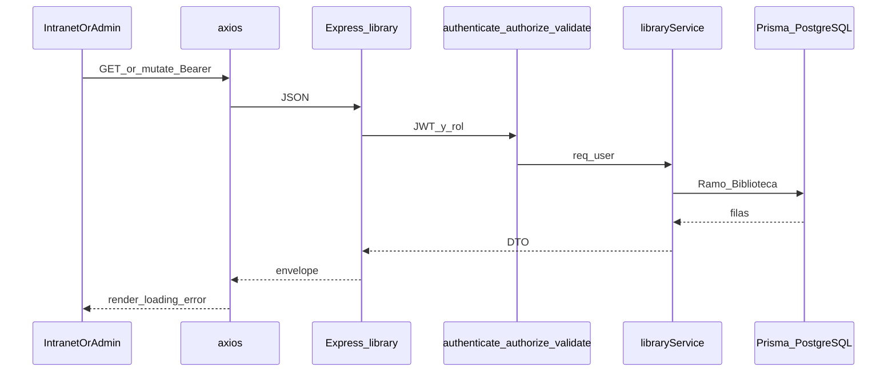

# MAPS-012 — TDD: Biblioteca Digital — API + persistencia + integración frontend

Documento de diseño técnico para conectar la Biblioteca Digital con la API REST, PostgreSQL (Prisma) y sustituir el store Zustand introducido en MAPS-011, siguiendo el patrón de MAPS-009 (productores).

**Estado:** Implementado
**Autor:** (equipo)
**Revisores:** —
**Creado:** 2026-05-19
**Última actualización:** 2026-05-19

> **UI previa:** [`docs/tdd/MAPS-011-tdd-biblioteca-digital.md`](./MAPS-011-tdd-biblioteca-digital.md) · [`docs/worklog/MAPS-011-biblioteca-digital.md`](../worklog/MAPS-011-biblioteca-digital.md)
> **Bitácora de implementación:** [`docs/worklog/MAPS-012-biblioteca-digital-api.md`](../worklog/MAPS-012-biblioteca-digital-api.md)

---

## Resumen

La Biblioteca Digital ya tiene UI en `/intranet/biblioteca` (solo lectura) y `/admin/biblioteca` (CRUD) con datos en memoria (`useLibraryStore`, `libraryMock.ts`). Este diseño expone `/api/v1/library/ramos` con persistencia Prisma, aplica **authenticate + authorize + validate** como en productores, alinea el modelo `Ramo` con el contrato de la UI y conecta el frontend vía servicio Axios. **PRODUCTOR** solo puede consultar ramos activos; **ADMIN** y **SUPERADMIN** gestionan el catálogo completo.

---

## Objetivo

- Persistir ramos en PostgreSQL y exponer CRUD admin bajo JWT para roles **ADMIN** y **SUPERADMIN**.
- Permitir a **PRODUCTOR** listar **solo ramos activos** (lectura); denegar mutaciones y panel admin en API y UI.
- Reutilizar middlewares, envelope `{ data, message, error }`, `AppError` y validación Zod (`422` con `flatten()`).
- Sustituir `useLibraryStore` y `libraryMock.ts` en el flujo principal del frontend.

---

## Contexto

### Situación actual

#### Backend

| Área | Estado |
|------|--------|
| **Rutas** | `backend/src/api/v1/index.ts` registra `v1Router.use('/library', libraryRouter)`. `backend/src/api/v1/routes/library.routes.ts` exporta un `Router()` **sin rutas registradas**. |
| **Controller** | `backend/src/controllers/library.controller.ts` solo expone `placeholder` → `501` con envelope estándar. |
| **Service** | `backend/src/services/library.service.ts` es `export const libraryService = {}`. |
| **Prisma** | `Biblioteca`, `Ramo`, `Recurso` en `backend/prisma/schema.prisma`. **`Ramo` incompleto** vs UI: faltan `icono`, `gdriveUrl`, `tipo`, `activo`. |
| **Auth** | `authenticate`, `authorize` y `validate` operativos (usados en `/producers`). |
| **Seed** | `backend/prisma/seed.ts` solo crea usuarios; **sin biblioteca ni ramos**. |

#### Frontend (MAPS-011)

| Pieza | Ubicación | Nota |
|-------|-----------|------|
| Store mock | `frontend/src/modules/admin/hooks/useLibraryStore.ts` | Zustand; `id` string UUID |
| Mock | `frontend/src/modules/admin/data/libraryMock.ts` | 16 ramos de ejemplo |
| Tipos | `frontend/src/modules/admin/types/library.ts` | `Ramo`, `RamoInput`, `RamoIcono`, `RamoTipo` |
| Intranet | `DigitalLibraryPage`, `LibraryRamosSection`, `LibrarySecondarySection` | Solo lectura; filtran `activo` y `tipo` |
| Admin | `LibraryManagementPage`, `LibraryManagementDashboard`, modales y tabla | CRUD vía store |
| Router | `frontend/src/router/index.tsx` | `/intranet/biblioteca` lectura (sidebar: PRODUCTOR, ADMIN, SUPERADMIN); `/admin/biblioteca` CRUD → `RoleGuard(['ADMIN','SUPERADMIN'])` |
| HTTP | `frontend/src/lib/axios.ts` | Ya usado en login y productores |

#### Desalineación Prisma ↔ UI

| Campo UI (`library.ts`) | BD actual (`Ramo`) |
|-------------------------|-------------------|
| `icono` | — |
| `gdriveUrl` | — (existe tabla `Recurso` con `url`, no usada por la UI) |
| `tipo` (PRINCIPAL \| SECUNDARIO) | — |
| `activo` | — |
| `id: string` | `Int` |
| `creadoEn` / `modificadoEn` | `createdAt` / `updatedAt` |

### Por qué ahora

MAPS-011 cerró la UX de biblioteca con mock client-side. Sin backend los links y ramos se pierden al recargar y no hay fuente única para demos operativas. MAPS-009 estableció el patrón de integración admin + seguridad en servidor.

---

## Alcance

- Migración Prisma: enum `RamoTipo` y campos en `Ramo`; `@@unique([bibliotecaId, nombre])`.
- Seed: una fila `Biblioteca` (singleton) + ramos iniciales equivalentes a `libraryMock.ts`.
- API REST bajo `/api/v1/library/ramos` con RBAC documentado.
- Validaciones Zod en `backend/src/validations/library.schema.ts`.
- Frontend: `library.service.ts`, hook de datos, cableado admin + intranet; retirar mock del flujo principal.
- Documentación: este TDD y work-log MAPS-012.

### Fuera de alcance

- Tabla `Recurso` y subida de archivos (contenido en Google Drive).
- Permisos granulares por ramo.
- Búsqueda o paginación server-side.
- Drag-and-drop para reordenar ramos.
- TanStack Query (mismo criterio que MAPS-009: hook + `refetch`).
- Noticias, mapa, perfil público, ecommerce.
- Rediseño visual de la biblioteca.

---

## Diseño propuesto

### Resumen



- **Biblioteca singleton:** una fila seed (ej. `id = 1`); todos los ramos usan `bibliotecaId = 1`.
- **Lectura productor:** el servicio fuerza `activo: true` si `req.user.role === PRODUCTOR`.
- **Escritura:** solo `ADMIN` y `SUPERADMIN` en rutas de mutación.

### Componentes / archivos afectados

| Pieza | Ubicación | Rol |
|-------|-----------|-----|
| Migración | `backend/prisma/migrations/..._library_ramo_fields/` | Nuevo — campos y enum en `Ramo` |
| Schema | `backend/prisma/schema.prisma` | Modificado — `RamoTipo`, campos, unique |
| Seed | `backend/prisma/seed.ts` | Modificado — biblioteca + 16 ramos |
| Rutas | `backend/src/api/v1/routes/library.routes.ts` | Modificado — registrar rutas + middlewares |
| Controller | `backend/src/controllers/library.controller.ts` | Modificado — handlers + DTO |
| Service | `backend/src/services/library.service.ts` | Modificado — Prisma + reglas RBAC en listado |
| Validación | `backend/src/validations/library.schema.ts` | Nuevo — Zod params/query/body |
| Servicio HTTP | `frontend/src/modules/admin/services/library.service.ts` | Nuevo — llamadas Axios |
| Hook | `frontend/src/modules/admin/hooks/useAdminLibrary.ts` | Nuevo — data, loading, error, refetch, mutaciones |
| Mapper | `frontend/src/modules/admin/lib/mapLibraryRamo.ts` | Nuevo — API ↔ UI |
| Dashboard / intranet | `LibraryManagementDashboard.tsx`, `LibraryRamosSection.tsx`, `LibrarySecondarySection.tsx` | Modificado — cablear hook |
| Store mock | `useLibraryStore.ts`, `libraryMock.ts` | Eliminar del flujo principal al cerrar |

### Modelo de datos

**Enum Prisma** `RamoTipo`: `PRINCIPAL` | `SECUNDARIO`.

**Campos nuevos en `Ramo`:**

| Campo | Tipo | Default | Notas |
|-------|------|---------|-------|
| `icono` | `String` | — | Claves alineadas a `RamoIcono` del front |
| `gdriveUrl` | `String` | — | URL `https://` validada en API |
| `tipo` | `RamoTipo` | `PRINCIPAL` | |
| `activo` | `Boolean` | `true` | Inactivo oculto en intranet |

**Restricción de unicidad:** `@@unique([bibliotecaId, nombre])` — conflicto → **409** en API.

```prisma
// Ilustrativo — aplicar en schema.prisma + migración
enum RamoTipo {
  PRINCIPAL
  SECUNDARIO
}

model Ramo {
  // ... campos existentes ...
  icono     String
  gdriveUrl String
  tipo      RamoTipo @default(PRINCIPAL)
  activo    Boolean  @default(true)

  @@unique([bibliotecaId, nombre])
}
```

**`Recurso`:** sin cambios en v1; documentado como extensión futura si negocio pide múltiples links por ramo.

### Contratos de API

Prefijo: `http://localhost:3000/api/v1` (prod: mismo path relativo). Todos los endpoints requieren `Authorization: Bearer <accessToken>`.

| Método | Ruta | Roles | Body / Query | Respuesta | Errores |
|--------|------|-------|--------------|-----------|---------|
| `GET` | `/library/ramos` | PRODUCTOR, ADMIN, SUPERADMIN | `?activo=true\|false` (opcional para admin) | `200 Ramo[]` | `401`, `403` |
| `GET` | `/library/ramos/:id` | ADMIN, SUPERADMIN | — | `200 Ramo` | `401`, `403`, `404` |
| `POST` | `/library/ramos` | ADMIN, SUPERADMIN | `RamoInput` | `201 Ramo` | `401`, `403`, `409`, `422` |
| `PATCH` | `/library/ramos/:id` | ADMIN, SUPERADMIN | parcial | `200 Ramo` | `401`, `403`, `404`, `409`, `422` |
| `PATCH` | `/library/ramos/:id/activo` | ADMIN, SUPERADMIN | `{ activo: boolean }` | `200 Ramo` | `401`, `403`, `404`, `422` |
| `DELETE` | `/library/ramos/:id` | ADMIN, SUPERADMIN | — | `204` | `401`, `403`, `404` |

**Reglas por rol en lectura:**

- **PRODUCTOR:** solo `GET /library/ramos`; el servicio **ignora** `activo=false` en query y devuelve únicamente ramos con `activo === true`. **403** en `GET /:id` y en toda mutación.
- **ADMIN / SUPERADMIN:** `GET` con filtro opcional; mutaciones completas.

**DTO de respuesta (conceptual):**

```json
{
  "id": 1,
  "nombre": "Automotores",
  "descripcion": "...",
  "icono": "car",
  "gdriveUrl": "https://drive.google.com/drive/folders/...",
  "tipo": "PRINCIPAL",
  "orden": 1,
  "activo": true,
  "creadoEn": "2026-05-01T12:00:00.000Z",
  "modificadoEn": "2026-05-01T12:00:00.000Z"
}
```

Mapper en servicio: `createdAt`/`updatedAt` → `creadoEn`/`modificadoEn`; `id` numérico en JSON (front puede usar `String(id)` en tablas si conviene).

**Envelope:** `{ data, message, error }` homogéneo con auth y productores.

### UI / UX

Sin rediseño. Cambios de integración únicamente:

- Intranet: `loading`, mensaje de error con reintento, datos desde `GET /library/ramos`.
- Admin: formularios y tabla llaman POST/PATCH/DELETE; `refetch` tras mutación exitosa.
- Errores `422`/`409` mapeados a campos o toast (patrón `apiError.ts` de productores).

### Cambios en código existente

- `library.routes.ts`: reemplazar router vacío por rutas con `adminOnly` e `intranetRead` (ver Permisos).
- Componentes intranet/admin: dejar de importar `useLibraryStore`; usar hook API.
- MAPS-011 TDD/work-log: referenciar MAPS-012 como ticket de backend (enlace en pendientes).

---

## Permisos / RBAC

| Rol | UI `/intranet/biblioteca` | UI `/admin/biblioteca` | API |
|-----|---------------------------|------------------------|-----|
| **PRODUCTOR** | Ver ramos activos; abrir Drive | **No** (`RoleGuard` → `/unauthorized`) | Solo `GET /library/ramos` (solo activos); **403** en resto |
| **ADMIN** | Ver ramos activos (lectura) | CRUD completo | `GET` (todos o filtro) + mutaciones |
| **SUPERADMIN** | Igual que ADMIN | CRUD completo | Igual que ADMIN |

**Implementación obligatoria en servidor:** no depender solo de `RoleGuard` del front.

**Patrón de rutas (referencia):**

```typescript
// library.routes.ts — análogo a producers.routes.ts
const adminOnly = [authenticate, authorize(Rol.ADMIN, Rol.SUPERADMIN)] as const;
const intranetRead = [
  authenticate,
  authorize(Rol.PRODUCTOR, Rol.ADMIN, Rol.SUPERADMIN),
] as const;
```

---

## Decisiones tomadas

- **PRODUCTOR = solo lectura; ADMIN / SUPERADMIN = CRUD** en API y UI, sin excepciones.
- **ADMIN** puede usar intranet (lectura) y panel admin (CRUD); **PRODUCTOR** no accede a `/admin/biblioteca`.
- **Unicidad** `nombre` por biblioteca → `@@unique([bibliotecaId, nombre])`; **409** en conflicto.
- **`gdriveUrl`:** cualquier URL **HTTPS** válida (Zod `.url()` + refinamiento `https://`); sin whitelist de dominio Drive.
- **Campos en `Ramo`**, no `Recurso` en v1: un link Drive por ramo, alineado a la UI.
- **Biblioteca singleton:** `bibliotecaId = 1` en seed; el form admin no elige biblioteca.
- **`PATCH`** (no `PUT`) y ruta **`PATCH /:id/activo`** para toggle, coherente con productores.
- **IDs numéricos** en API; mapper opcional a `string` en filas UI.
- **Borrado físico** en DELETE (como el mock actual); desactivar vía `activo`.

---

## Alternativas consideradas

### Alternativa A — Usar tabla `Recurso` para cada URL

- **Qué era:** Persistir links en `Recurso` con FK a `Ramo`.
- **Pros:** Schema ya existe.
- **Contras:** La UI no modela múltiples recursos; más joins y endpoints.
- **Por qué se descartó:** No coincide con `gdriveUrl` único por card/pill en MAPS-011.

### Alternativa B — GET público sin autenticación para ramos activos

- **Qué era:** Endpoint abierto para la intranet.
- **Pros:** Menos JWT en lectura.
- **Contras:** El portal es autenticado; expone catálogo sin control.
- **Por qué se descartó:** Inconsistente con auth del resto del intranet.

### Alternativa C — `PUT` en lugar de `PATCH`

- **Qué era:** Seguir el borrador inicial de MAPS-011 en contratos.
- **Pros:** Sustitución total del recurso.
- **Contras:** Inconsistente con `/producers` y toggle parcial.
- **Por qué se descartó:** Alinear con MAPS-009.

---

## Plan de implementación

### Fase 0 — Datos y seguridad

- [x] Migración Prisma (`RamoTipo`, campos, `@@unique`) + `prisma generate`
- [x] Extender `seed.ts`: 1 `Biblioteca` + 16 ramos desde `libraryMock.ts`
- [x] Crear `library.schema.ts` (params, query, create, update, activo)

### Fase 1 — API lectura

- [x] `GET /library/ramos` con filtro por rol en `libraryService`
- [x] `GET /library/ramos/:id` (admin)
- [x] Frontend intranet: hook + `library.service.ts` para listar activos

### Fase 2 — API escritura + integración admin

- [x] `POST`, `PATCH`, `PATCH /:id/activo`, `DELETE`
- [x] Cablear `LibraryManagementDashboard` y modales
- [x] Estados loading / error / refetch

### Fase 3 — Cierre

- [x] Eliminar `useLibraryStore` y `libraryMock.ts` del flujo principal
- [x] Actualizar work-log MAPS-012 y TDD a **Implementado**
- [x] `npm run build` backend + frontend

---

## Riesgos y mitigaciones

| Riesgo | Probabilidad | Impacto | Mitigación |
|--------|-------------|---------|------------|
| PRODUCTOR ve ramos inactivos | Media | Alto | Filtro obligatorio en service por rol |
| Conflicto de nombre al crear/editar | Media | Medio | Unique en Prisma + 409 documentado |
| Desalineación `id` string ↔ number | Media | Medio | Mapper único en front |
| URLs maliciosas en `gdriveUrl` | Baja | Medio | Solo `https://`; sin ejecución server-side del link |

---

## Plan de rollout

- [ ] Feature flag: opcional `VITE_USE_MOCK_LIBRARY` en dev; default `false` en integración
- [ ] Migraciones: una migración forward; orden: deploy backend → migrate → seed → front
- [ ] Variables de entorno nuevas: ninguna obligatoria (reutiliza `DATABASE_URL`, JWT, `VITE_API_BASE_URL`)
- [ ] Comunicación a usuarios: informar cuando biblioteca persista en BD
- [ ] Plan de rollback: revertir front a Zustand (commit anterior) si API falla; migración reversible solo si no hay datos prod críticos

---

## Métricas de éxito

- Productor autenticado ve solo ramos activos en `/intranet/biblioteca` tras F5.
- Admin crea/edita/desactiva/elimina ramos y los cambios persisten en PostgreSQL.
- PRODUCTOR recibe **403** en POST/PATCH/DELETE y en `GET /library/ramos/:id`.
- Llamada sin token → **401**.
- Nombre duplicado en la misma biblioteca → **409**.
- `gdriveUrl` no HTTPS → **422**.

---

## Preguntas abiertas

### Resueltas en diseño MAPS-012

| Tema | Decisión |
|------|----------|
| Unicidad de `nombre` por biblioteca | **Sí** — unique compuesto + 409 |
| Validación dominio Drive | **Cualquier HTTPS** |
| ADMIN en intranet | **Sí** — lectura en intranet + CRUD en admin |
| PRODUCTOR vs CRUD | **Solo lectura** en intranet; sin admin ni mutaciones API |

---

## Referencias

- **UI / diseño previo:** [`MAPS-011-tdd-biblioteca-digital.md`](./MAPS-011-tdd-biblioteca-digital.md)
- **Patrón API:** [`MAPS-009-tdd-admin-api-productores.md`](./MAPS-009-tdd-admin-api-productores.md)
- **Convenciones:** [`docs/CONVENTIONS.md`](../CONVENTIONS.md)
- **Plantilla TDD:** [`_TEMPLATE-tdd.md`](./_TEMPLATE-tdd.md)
- **Router productores:** `backend/src/api/v1/routes/producers.routes.ts`
- **Tipos front:** `frontend/src/modules/admin/types/library.ts`
- **Work-log de implementación:** [`docs/worklog/MAPS-012-biblioteca-digital-api.md`](../worklog/MAPS-012-biblioteca-digital-api.md)
