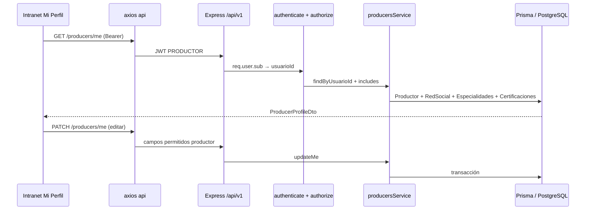

# MAPS-013 — TDD: Vista Mi Perfil — Intranet Productor + URL por slug

Documento de diseño técnico para la vista **Mi Perfil** del productor en intranet, alimentada por datos cargados por admin (MAPS-009) y editables por el propio productor, con URL única basada en `slug`.

**Estado:** Fase 1 implementada · Fase 2 planificada  
**Autor:** (equipo)  
**Revisores:** —  
**Creado:** 2026-05-26  
**Última actualización:** 2026-05-26 (Fase 2)  

> **Referencia visual:** mock «Vista de Perfil de Productor» (sidebar intranet + cards de trayectoria, especialidades, mapa, certificaciones).  
> **Work-log de implementación (al cerrar):** [`docs/worklog/MAPS-013-vista-perfil-productor.md`](../worklog/MAPS-013-vista-perfil-productor.md)

---

## Resumen

La ruta `/intranet/mi-perfil` hoy es un stub. Esta feature entrega la pantalla completa del mock (header con foto, badge verificado, matrícula, contacto, trayectoria, grilla de especialidades, stats, mapa de influencia, certificaciones descargables y CTA **Editar Perfil**), con datos persistidos en PostgreSQL.

Cada productor tendrá URL propia **`/intranet/perfil/:slug`** (p. ej. `/intranet/perfil/carlos-rodriguez`). `/intranet/mi-perfil` redirige al slug del usuario autenticado. Se extiende el modelo `Productor` y se exponen endpoints de lectura/edición para rol **PRODUCTOR** (solo su perfil) y ampliación del alta/edición admin donde corresponda.

---

## Objetivo

- Renderizar la vista de perfil del productor **tal cual el diseño acordado**, dentro del layout intranet (`AppLayout` + sidebar).
- Mostrar datos reales: los cargados por **ADMIN/SUPERADMIN** al crear/editar productor y los actualizados por el productor vía **Editar Perfil**.
- Garantizar **URL canónica por slug** en intranet, reutilizando el `slug` ya generado en MAPS-009.
- Definir contrato API y migraciones necesarias para campos que hoy no existen (matrícula, idiomas, stats, especialidades, certificaciones, WhatsApp, redes, geo).

---

## Contexto

### Situación actual

| Área | Estado |
|------|--------|
| **Intranet UI** | `ProducerProfileViewPage.tsx` — vista completa con API real; `/intranet/mi-perfil` redirige a `/intranet/perfil/:slug`. |
| **Formulario edición** | `ProducerProfileForm.tsx` — modal funcional (`PATCH /me`, upload PDF). |
| **Perfil público** | `/productor/:slug` consume `GET /producers/by-slug/:slug`. |
| **API productor** | `GET/PATCH /producers/me`, upload cert (Fase 1: ruta singular + columna plana). |
| **API admin** | MAPS-009 básico; **Fase 2 pendiente:** PATCH extendido, certs admin, campos matrícula/verificado/stats en UI. |
| **Prisma `Productor`** | Campos extendidos (matrícula, verificado, stats, especialidades JSON). Cert Fase 1: columnas `certificacion`/`certificacionNombre` → **Fase 2:** tabla `Certificacion`. |
| **Storage** | Fase 1: disco local `uploads/certificaciones/`. **Fase 2:** adapter `STORAGE_PROVIDER` (local \| s3). |
| **Seed** | Productor demo `carlos-rodriguez` con perfil completo. |

### Por qué ahora

MAPS-009 cerró CRUD admin de productores con `slug` único. MAPS-011/012 entregaron biblioteca intranet. **Mi Perfil** es el siguiente módulo del sidebar productor marcado como pendiente y bloquea la experiencia completa del rol **PRODUCTOR** y la futura sincronización con el perfil público `/productor/:slug`.

---

## Alcance

- **Migración Prisma** con campos y tablas hijas necesarios para el mock (ver § Modelo de datos).
- **API**:
  - Lectura del perfil propio (`GET /producers/me`).
  - Lectura pública por slug (`GET /producers/by-slug/:slug`) — respuesta sin datos sensibles.
  - Actualización del perfil propio (`PATCH /producers/me`) con reglas de quién puede editar qué.
  - Ampliación opcional de `PATCH /producers/:id` admin para campos extendidos (matrícula, verificado, stats iniciales, etc.).
- **Frontend intranet**:
  - Página `ProducerProfileViewPage` (o refactor de `MyProfilePage`) con layout del mock.
  - Modal/página **Editar Perfil** (`ProducerProfileForm` funcional).
  - Ruta **`/intranet/perfil/:slug`** + redirect desde `/intranet/mi-perfil`.
  - Guard: si `:slug` ≠ slug del usuario logueado → `/unauthorized` (solo ve su perfil).
- **Componentes UI** reutilizables (cards, grilla especialidades, lista certificaciones, mapa estático/embed).
- **Seed QA**: productor de ejemplo con datos completos alineados al mock.
- **Documentación**: work-log MAPS-013 al cerrar implementación.

### Fuera de alcance (Fase 1 — ya entregado)

- Rediseño visual adicional del perfil público (UI mínima operativa entregada).
- Mapa interactivo (Leaflet/Mapbox).
- Flujo **«debe cambiar contraseña»** o invitación por email.

### Alcance Fase 2 — Operación real completa

- **Admin CRUD extendido:** matrícula, verificado, stats, título profesional y precarga de perfil (bio, coords, especialidades, etc.).
- **Tabla `Certificacion`:** múltiples PDFs por productor; migración desde columnas planas Fase 1.
- **Storage abstracto:** `STORAGE_PROVIDER=local|s3`; multer en memoria + adapter; URLs públicas vía `API_PUBLIC_URL` o CDN.
- **UI admin:** secciones en `ProducerFormModal` + gestión de certs en edición; `ProducerViewModal` con badge/stats/certs.
- **Rutas certificaciones:** `POST/DELETE` admin y productor (plural `/certificaciones`).

### Fuera de alcance Fase 2

- Upload de **foto de perfil** (sigue URL string; reutilizar adapter en ticket futuro).
- **Vercel Blob** como tercer adapter (S3-compatible cubre R2/MinIO).
- `/admin/mi-perfil` para rol ADMIN.
- E2E Playwright.

---

## Diseño propuesto

### Resumen



- **URL intranet:** canonical ` /intranet/perfil/:slug`. Entrada sidebar `/intranet/mi-perfil` → `Navigate` al slug del JWT/sesión.
- **URL pública (existente):** `/productor/:slug` sin cambios de ruta en este ticket; opcionalmente cablear a `GET /producers/by-slug/:slug` si el DTO público queda listo.
- **Fuente de verdad:** PostgreSQL; eliminar dependencia de `producerProfilesMock.ts` para perfiles reales cuando se integre perfil público.

### Componentes / archivos afectados

| Pieza | Ubicación | Rol |
|-------|-----------|-----|
| Migración Prisma | `backend/prisma/migrations/...` | **Nuevo** — columnas y tablas hijas. |
| Schema | `backend/prisma/schema.prisma` | **Modificado** — campos perfil extendido. |
| Validaciones Zod | `backend/src/validations/producer.schema.ts`, `producerProfile.schema.ts` (nuevo) | **Modificado/Nuevo** — bodies me/edición admin. |
| Service | `backend/src/services/producers.service.ts` | **Modificado** — `getMe`, `getBySlug`, `updateMe`, includes. |
| Controller / routes | `backend/src/controllers/producers.controller.ts`, `routes/producers.routes.ts` | **Modificado** — rutas me + by-slug + RBAC PRODUCTOR. |
| Seed | `backend/prisma/seed.ts` | **Modificado** — productor demo + perfil completo. |
| Tipos perfil | `frontend/src/modules/intranet/types/producerProfile.ts` (nuevo) | **Nuevo** — DTO alineado a API. |
| Servicio HTTP | `frontend/src/modules/intranet/services/producerProfile.service.ts` (nuevo) | **Nuevo** — getMe, updateMe. |
| Hook datos | `frontend/src/modules/intranet/hooks/useProducerProfile.ts` (nuevo) | **Nuevo** — loading/error/refetch. |
| Vista perfil | `frontend/src/modules/intranet/pages/MyProfilePage.tsx` o `ProducerProfilePage.tsx` | **Modificado** — UI completa mock. |
| Subcomponentes | `frontend/src/modules/intranet/components/profile/*` | **Nuevo** — header, trayectoria, especialidades, stats, mapa, certs. |
| Form edición | `frontend/src/modules/intranet/components/ProducerProfileForm.tsx` | **Modificado** — modal form funcional. |
| Router | `frontend/src/router/index.tsx` | **Modificado** — `perfil/:slug`, redirect mi-perfil. |
| Sidebar | `frontend/src/shared/constants/sidebarItems.tsx` | **Modificado** — link dinámico o mantener mi-perfil con redirect. |

### Modelo de datos

#### Columnas nuevas en `Productor`

| Campo | Tipo | Notas |
|-------|------|-------|
| `matricula` | `String?` @unique | Ej. `#78429`; visible en header. |
| `verificado` | `Boolean` @default(false) | Badge «PRODUCTOR VERIFICADO». |
| `idiomas` | `String[]` o `Json` | Ej. `["Español", "Inglés"]`. |
| `whatsapp` | `String?` | Dígitos para `wa.me`. |
| `anosExperiencia` | `Int?` | Stat «15+ Años». |
| `clientesActivos` | `Int?` | Stat «500+ Clientes». |
| `tituloProfesional` | `String?` | Ej. «Productor de Seguros» (prefijo antes de matrícula). |

```sql
-- Ilustrativo — generado vía prisma migrate
ALTER TABLE "Productor" ADD COLUMN "matricula" TEXT;
ALTER TABLE "Productor" ADD COLUMN "verificado" BOOLEAN NOT NULL DEFAULT false;
ALTER TABLE "Productor" ADD COLUMN "idiomas" JSONB;
ALTER TABLE "Productor" ADD COLUMN "whatsapp" TEXT;
ALTER TABLE "Productor" ADD COLUMN "anos_experiencia" INTEGER;
ALTER TABLE "Productor" ADD COLUMN "clientes_activos" INTEGER;
ALTER TABLE "Productor" ADD COLUMN "titulo_profesional" TEXT;
CREATE UNIQUE INDEX "Productor_matricula_key" ON "Productor"("matricula") WHERE "matricula" IS NOT NULL;
```

#### Tabla `ProductorEspecialidad` (catálogo fijo + selección)

Opción recomendada: **catálogo enum en código** + tabla puente `ProductorEspecialidad` (`productorId`, `clave`, `orden`).

Claves alineadas al mock (8 ítems):

`salud-integral`, `automotores`, `riesgos-art`, `hogar-pyme`, `vida-ahorro`, `viajero`, `mascotas`, `ciber-risk`.

Alternativa descartada en Fase 1: tabla `Especialidad` administrable — over-engineering para lista fija del diseño.

#### Tabla `Certificacion`

```prisma
model Certificacion {
  id          Int      @id @default(autoincrement())
  productorId Int
  nombre      String
  archivoUrl  String   @map("archivo_url")
  tamanoBytes Int?     @map("tamano_bytes")
  mimeType    String   @default("application/pdf") @map("mime_type")
  orden       Int      @default(0)
  createdAt   DateTime @default(now())
  updatedAt   DateTime @updatedAt

  productor Productor @relation(fields: [productorId], references: [id], onDelete: Cascade)

  @@index([productorId])
}
```

#### `RedSocial` (existente)

Usar modelo actual: `plataforma` (`linkedin`, `instagram`, …), `url`, `orden`. Admin o productor pueden mantener URLs en PATCH.

### Contratos de API

Envelope estándar: `{ data, message, error }`.

| Método | Ruta | Auth | Body / Query | Respuesta | Errores |
|--------|------|------|--------------|-----------|---------|
| `GET` | `/producers/me` | Bearer, rol **PRODUCTOR** | — | `200 { profile: ProducerProfileDto }` | `401`, `403`, `404` sin fila Productor |
| `PATCH` | `/producers/me` | Bearer, rol **PRODUCTOR** | `UpdateMyProfileBody` (parcial) | `200 { profile }` | `400`, `409` unicidad |
| `GET` | `/producers/by-slug/:slug` | **Público** (sin token) | — | `200 { profile: PublicProducerProfileDto }` | `404` |
| `PATCH` | `/producers/:id` | ADMIN \| SUPERADMIN | Ampliar con campos extendidos + `verificado` | `200` (existente) | igual MAPS-009 |

**`ProducerProfileDto` (intranet — incluye email):**

```json
{
  "id": 1,
  "slug": "carlos-rodriguez",
  "nombre": "Carlos",
  "apellido": "A. Rodríguez",
  "nombreCompleto": "Carlos A. Rodríguez",
  "tituloProfesional": "Productor de Seguros",
  "matricula": "78429",
  "verificado": true,
  "bio": "…",
  "ciudad": "Madrid, España",
  "idiomas": ["Español", "Inglés"],
  "foto": "https://…",
  "telefono": "+34 …",
  "whatsapp": "34600123456",
  "email": "carlos@maps.com",
  "anosExperiencia": 15,
  "clientesActivos": 500,
  "latitud": 40.4168,
  "longitud": -3.7038,
  "especialidades": [
    { "clave": "salud-integral", "label": "Salud Integral" }
  ],
  "redesSociales": [
    { "plataforma": "linkedin", "url": "https://…" }
  ],
  "certificaciones": [
    { "id": 1, "nombre": "Cédula Profesional", "archivoUrl": "…", "tamanoBytes": 2516582 }
  ]
}
```

**`PublicProducerProfileDto`:** mismo shape **sin** `email`, `dni`, `id` interno; omitir certificaciones si negocio lo define así.

**`UpdateMyProfileBody` (productor puede editar):**

- `bio`, `ciudad`, `telefono`, `whatsapp`, `foto` (URL), `idiomas`, `latitud`, `longitud`, `especialidades[]`, `redesSociales[]`, `certificaciones[]` (solo metadatos + URL si no hay upload).
- **No editable por productor (solo admin):** `verificado`, `matricula`, `anosExperiencia`, `clientesActivos`, `nombre`/`apellido` (salvo decisión contraria), `slug`.

### UI / UX

Referencia: mock «Vista de Perfil de Productor» (captura en repo / Figma).

| Bloque | Contenido | Estados |
|--------|-----------|---------|
| **Header card** | Foto, nombre completo, badge verificado, título + matrícula, ciudad, idiomas, botones WhatsApp / Email / Editar Perfil | Loading skeleton; empty parcial (ocultar botones sin dato) |
| **Trayectoria** | `bio` en párrafos | Empty: mensaje «Completá tu trayectoria en Editar Perfil» |
| **Especialidades** | Grilla 4×2 responsive con iconos teal | Empty: ninguna seleccionada |
| **Stats** | Años experiencia, clientes activos | Ocultar card si null |
| **Zona de influencia** | Mapa + pin; iconos LinkedIn/Instagram bajo mapa | Sin coords: placeholder ciudad textual |
| **Certificaciones** | Lista con icono doc, nombre, PDF • tamaño, descarga | Empty state discreto |
| **Editar Perfil** | Modal o ruta secundaria; guardar → PATCH me + toast + refetch | Validación inline; error API en banner |

**Routing UX:**

```
/intranet/mi-perfil  → 302/replace → /intranet/perfil/{slug-del-usuario}
/intranet/perfil/otro-slug  → /unauthorized (si PRODUCTOR y slug ≠ propio)
```

### Cambios en código existente

- **`producers.routes.ts`:** registrar rutas **antes** de `/:id` para evitar colisión (`/me`, `/by-slug/:slug`).
- **`ProducerProfilePage` (público):** sin cambio obligatorio en Fase 1; preparar tipos compartidos en `shared/types` si conviene.
- **`MyProfilePage`:** reemplazar stub; admins que usan `/admin/mi-perfil` pueden quedar fuera de alcance (stub actual compartido) — ver preguntas abiertas.

---

## Decisiones tomadas

- **Slug canónico intranet:** `/intranet/perfil/:slug`; sidebar puede seguir apuntando a `/intranet/mi-perfil` con redirect automático.
- **Slug generado en alta (MAPS-009):** no editable por productor; admin puede regenerar solo en ticket futuro.
- **Badge verificado:** boolean `Productor.verificado`, solo admin lo activa.
- **Especialidades:** catálogo fijo de 8 claves del mock; persistir selección en tabla puente.
- **Certificaciones Fase 1:** URLs de PDF ya hosteadas (admin carga URL); descarga vía `<a download href>` o nueva pestaña.
- **Mapa Fase 1:** componente `InfluenceMap` con imagen OpenStreetMap static o iframe liviano usando lat/lng; sin API key en Fase 1.
- **Email contacto:** tomar de `Usuario.usuario`; botón Email → `mailto:`.
- **WhatsApp:** columna dedicada + botón verde `wa.me/{whatsapp}`.
- **Autorización:** `GET/PATCH /producers/me` resuelve productor por `req.user.sub` (usuarioId JWT); no confiar en `:slug` del cliente para escritura.

---

## Alternativas consideradas

### Alternativa A — Solo `/intranet/mi-perfil` sin slug en URL

- **Qué era:** Mantener ruta fija; mostrar slug solo como «copiar enlace público».
- **Pros:** Menos routing; guard trivial.
- **Contras:** No cumple requisito explícito de URL propia del productor; peor shareabilidad interna.
- **Por qué se descartó:** Requisito de negocio de URL con slug.

### Alternativa B — Unificar intranet y público en `/perfil/:slug`

- **Qué era:** Una sola ruta para ambos contextos; layout condicional según auth.
- **Pros:** Un solo page component.
- **Contras:** Mezcla guards, sidebar y SEO público; más acoplamiento.
- **Por qué se descartó:** Separar `/intranet/perfil/:slug` (privado, layout app) de `/productor/:slug` (público) mantiene MAPS-004 routing limpio.

### Alternativa C — JSON blob único `profileData` en Productor

- **Qué era:** Guardar especialidades, certs y redes en un campo JSON.
- **Pros:** Migración mínima.
- **Contras:** Queries y validación débiles; difícil integridad referencial.
- **Por qué se descartó:** Tablas hijas alineadas a Prisma existente (`RedSocial`, `Certificacion`).

---

## Plan de implementación

### Fase 0 — Modelo y seed

- [x] Migración Prisma (columnas + `Certificacion` + puente especialidades).
- [x] Extender seed: usuario `user` + `Productor` «Carlos Rodríguez» con datos del mock.
- [x] Schemas Zod backend.

### Fase 1 — API

- [x] `GET /producers/me`, `PATCH /producers/me` con RBAC PRODUCTOR.
- [x] `GET /producers/by-slug/:slug` público (DTO reducido).
- [x] Ampliar PATCH admin para campos solo-admin (`verificado`, `matricula`, stats) — **Fase 2**.
- [x] Tests integración mínimos (me + by-slug + 403 cross-user).

### Fase 2 — UI intranet lectura

- [x] Componentes profile según mock (Tailwind + tokens `maps.*`).
- [x] Hook + servicio; estados loading/error/empty.
- [x] Rutas `perfil/:slug` + redirect `mi-perfil`.
- [x] Guard slug ≠ propio.

### Fase 3 — Edición productor

- [x] `ProducerProfileForm` modal: bio, contacto, idiomas, especialidades multi-select, redes, coords opcionales.
- [x] PATCH me + refetch + feedback.

### Fase 4 — Pulido

- [x] Accesibilidad (labels botones, alt foto).
- [x] Responsive grilla especialidades (2 cols mobile, 4 desktop).
- [x] Work-log MAPS-013 y actualizar README estado real.

### Fase 5 — Operación real (admin + certs + storage)

- [x] Migración `Certificacion` + data migration desde columnas legacy.
- [x] Storage adapter `STORAGE_PROVIDER=local|s3`.
- [x] PATCH admin extendido + DTO admin completo.
- [x] Rutas `POST/DELETE /producers/:id/certificaciones` y `/me/certificaciones`.
- [x] UI admin: matrícula, verificado, stats, gestión de certs.
- [x] UI intranet/público: lista múltiple de certificaciones.
- [x] Tests integración admin + upload/delete certs.

---

## Riesgos y mitigaciones

| Riesgo | Probabilidad | Impacto | Mitigación |
|--------|--------------|---------|------------|
| Colisión rutas Express `/me` vs `/:id` | Media | Alto | Registrar `/me` y `/by-slug/:slug` **antes** de `/:id`. |
| Usuario PRODUCTOR sin fila Productor | Media | Alto | 404 claro + seed; validar en login o onboarding admin. |
| Mock pide campos no acordados con negocio | Media | Medio | Preguntas abiertas cerradas antes de Fase 0; defaults nullables. |
| Upload PDF sin storage | Alta | Medio | Fase 1 solo URLs; ticket futuro Blob/S3. |
| Mapa sin API key | Baja | Bajo | Static map o placeholder con ciudad. |

---

## Plan de rollout

- [ ] Feature flag: **no** — feature acotada a intranet productor.
- [ ] Migraciones: una migración forward; probar `prisma migrate deploy` en Docker.
- [ ] Env nuevas: ninguna obligatoria Fase 1 (URLs cert externas).
- [ ] Comunicación: avisar a admins que nuevos campos se cargan desde admin o quedan editables por productor.
- [ ] Rollback: revert migración solo si no hay datos prod; en dev `migrate reset`.

---

## Métricas de éxito

- Productor autenticado ve su perfil completo en `/intranet/perfil/{slug}` con datos de BD (< 1s TTI local).
- Editar y guardar bio/contacto persiste tras refresh.
- Acceder a slug ajeno en intranet → `/unauthorized`.
- `GET /producers/by-slug/:slug` responde 200 sin auth para perfil activo (usuario activo).
- 0 errores de consola en carga de la página (criterio MAPS-011).

---

## Preguntas abiertas

- [x] ¿El productor puede editar **nombre/apellido** o solo admin? — **Solo admin**
- [x] ¿**Matrícula** la asigna solo admin o también productor? — **Solo admin**
- [x] ¿Stats (años/clientes) son editables por productor o solo admin? — **Solo admin**
- [ ] ¿`/admin/mi-perfil` debe reutilizar la misma vista o sigue stub para ADMIN? — _responde:_ producto
- [ ] ¿Integrar perfil público `/productor/:slug` rediseño UI en MAPS-014? — _responde:_ equipo
- [x] ¿Proveedor de mapa (static OSM vs Google Maps)? — **Static OSM Fase 1**
- [x] ¿Storage certificaciones? — **Adapter `local|s3` vía `STORAGE_PROVIDER`**

---

## Referencias

- **Mock / captura:** `assets/…/Vista_de_Perfil_de_Productor*.png` (workspace Cursor)
- **Tickets:** MAPS-013 (este), MAPS-009 (admin productores), MAPS-004 (routing)
- **Código actual:** `frontend/src/modules/intranet/pages/MyProfilePage.tsx`, `backend/prisma/schema.prisma`
- **Work-log de implementación:** [`docs/worklog/MAPS-013-vista-perfil-productor.md`](../worklog/MAPS-013-vista-perfil-productor.md)
